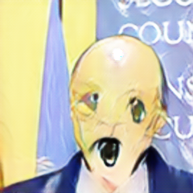

# AnimeCamera
An Android app that transforms selfies to anime (tries, at least)

The neural network model was created and trained using [this repository](https://github.com/junyanz/pytorch-CycleGAN-and-pix2pix) and my amateur dataset collected from various sites

Input:

Output:

